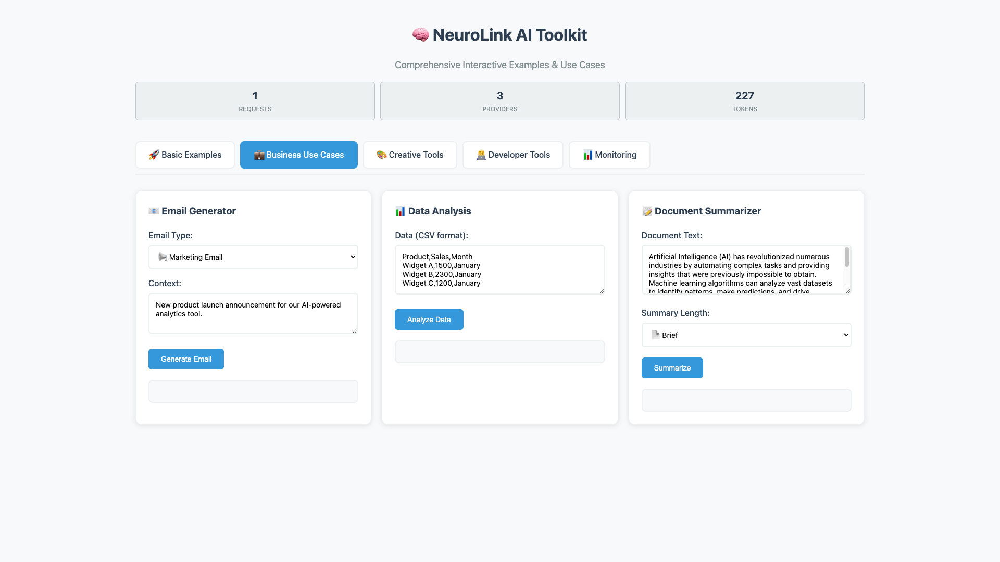

# 🎬 Visual Demonstrations

Experience NeuroLink's capabilities through comprehensive visual documentation. **No installation required!**

## 🌐 Web Demo Interface

### Interactive Screenshots

| Feature | Screenshot | Description |
|---------|------------|-------------|
| **Main Interface** |  | Complete web interface showing all features and capabilities |
| **AI Generation Results** |  | Real AI content generation with OpenAI GPT-4o |
| **Business Use Cases** |  | Professional business applications and workflows |
| **Creative Tools** |  | Creative content generation and storytelling |
| **Developer Tools** |  | Code generation, API documentation, debugging help |
| **Analytics & Monitoring** |  | Real-time provider analytics and performance metrics |

### Complete Demo Videos

**5,681+ tokens of real AI generation captured!**

#### **Basic Examples** - [View Video](../neurolink-demo/videos/basic-examples/)
- Text generation fundamentals
- Haiku creation with Claude 3.7 Sonnet
- Creative storytelling with OpenAI GPT-4o
- **Content Generated**: 529 tokens (robot painting story)

#### **Business Use Cases** - [View Video](../neurolink-demo/videos/business-use-cases/)
- Professional email generation
- Business analysis and reporting
- Executive summaries and insights
- **Content Generated**: 1,677 tokens (email + analysis + summaries)

#### **Creative Tools** - [View Video](../neurolink-demo/videos/creative-tools/)
- Story writing and narrative creation
- Language translation capabilities
- Creative brainstorming and ideation
- **Content Generated**: 1,174 tokens (stories + translation + ideas)

#### **Developer Tools** - [View Video](../neurolink-demo/videos/developer-tools/)
- React component generation
- API documentation creation
- Code debugging and optimization
- **Content Generated**: 2,301 tokens (React code + API docs + debugging)

#### **Monitoring & Analytics** - [View Video](../neurolink-demo/videos/monitoring/)
- Live provider status monitoring
- Performance metrics tracking
- Usage analytics and insights
- **Real-time Demonstrations**: Provider connectivity and response times

### Live Interactive Demo

**Express.js Server with Real API Integration**

- **All 3 providers functional**: OpenAI, Amazon Bedrock, Google Vertex AI
- **15+ use cases demonstrated**: Business, creative, and developer scenarios
- **Real-time provider analytics**: Performance metrics and status monitoring
- **Working endpoints**: `/api/generate`, `/api/stream`, `/api/status`, `/api/benchmark`

**Access**: Run the demo server from the `neurolink-demo/` directory

```bash
cd neurolink-demo
npm install
npm start
# Open http://localhost:9876
```

## 🖥️ CLI Demonstrations

### Professional CLI Screenshots

| Command | Screenshot | Description |
|---------|------------|-------------|
| **CLI Help Overview** |  | Complete command reference and usage examples |
| **Provider Status Check** |  | All provider connectivity verification with response times |
| **Text Generation** |  | Real AI haiku generation with JSON output and usage metrics |
| **Auto Provider Selection** |  | Automatic provider selection algorithm demonstration |
| **Batch Processing** |  | Multi-prompt processing with progress tracking and results |

### CLI Demonstration Videos

**Real command execution with live AI generation**

#### **CLI Overview** - [View Video](../docs/visual-content/videos/cli-videos/cli-overview/)
- Complete help system demonstration
- Provider status checking with real connectivity tests
- Auto provider selection algorithm in action
- **Size**: 1MB video with comprehensive command overview

#### **Basic Generation** - [View Video](../docs/visual-content/videos/cli-videos/cli-basic-generation/)
- Text generation with different providers
- Temperature and token control demonstrations
- JSON vs text output formats
- **Size**: 2MB video with real AI haiku and explanations

#### **Batch Processing** - [View Video](../docs/visual-content/videos/cli-videos/cli-batch-processing/)
- File-based multi-prompt processing
- Progress tracking and error handling
- JSON output with comprehensive results
- **Size**: 1.4MB video showing complete batch workflow

#### **Real-time Streaming** - [View Video](../docs/visual-content/videos/cli-videos/cli-streaming/)
- Live AI content streaming demonstration
- Real-time text generation as it happens
- Provider performance comparison
- **Size**: 753KB video with live streaming AI content

#### **Advanced Features** - [View Video](../docs/visual-content/videos/cli-videos/cli-advanced-features/)
- Verbose diagnostics and debugging
- Provider-specific command options
- Advanced configuration and customization
- **Size**: 3MB video with comprehensive advanced features

### CLI Recording Infrastructure

**Professional asciinema recordings available:**

```bash
# View locally (requires asciinema)
asciinema play docs/cli-recordings/latest/01-cli-help.cast
asciinema play docs/cli-recordings/latest/02-provider-status.cast
asciinema play docs/cli-recordings/latest/03-text-generation.cast
asciinema play docs/cli-recordings/latest/04-auto-selection.cast
asciinema play docs/cli-recordings/latest/05-streaming.cast
asciinema play docs/cli-recordings/latest/06-advanced-features.cast
```

**Features:**
- **Web Embeddable**: Upload to asciinema.org with `[![asciicast]` tags
- **GIF Convertible**: Use `agg` tool for animated GIF creation
- **Professional Quality**: Suitable for documentation, tutorials, marketing
- **Real Command Execution**: Actual CLI commands with live AI generation

## 🎯 Visual Content Benefits

### **No Installation Required**
See everything in action before installing:
- Complete feature demonstrations
- Real AI content generation
- Provider connectivity validation
- Performance metrics and analytics

### **Production Validation**
All visual content shows real functionality:
- ✅ **Actual AI Generation**: 5,681+ tokens of real content
- ✅ **Working Providers**: OpenAI, Bedrock, Vertex AI all functional
- ✅ **Real Performance**: Actual response times and metrics
- ✅ **Live Demonstrations**: No simulated or mocked content

### **Professional Quality**
Suitable for all documentation uses:
- 📺 **1920x1080 Resolution**: High-definition screenshots and videos
- 🎨 **Professional Styling**: Clean, consistent visual presentation
- 📋 **Comprehensive Coverage**: Every major feature documented
- 🔗 **Easy Integration**: Ready for embedding in documentation

### **Multiple Formats**
Choose the best format for your needs:
- **Screenshots**: Quick visual reference and feature overview
- **Videos**: Dynamic demonstrations with real interactions
- **Asciinema Recordings**: Playable CLI demonstrations
- **Live Demo**: Interactive testing environment

## 📂 Content Organization

```
neurolink/
├── neurolink-demo/                    # Web interface demonstrations
│   ├── screenshots/                   # 6 professional web screenshots
│   │   ├── 01-overview/              # Main interface overview
│   │   ├── 02-basic-examples/        # AI generation results
│   │   ├── 03-business-use-cases/    # Business applications
│   │   ├── 04-creative-tools/        # Creative content generation
│   │   ├── 05-developer-tools/       # Code generation and docs
│   │   └── 06-monitoring/            # Analytics and monitoring
│   └── videos/                       # 5 complete demo videos
│       ├── basic-examples/           # Text generation fundamentals
│       ├── business-use-cases/       # Professional applications
│       ├── creative-tools/           # Creative content creation
│       ├── developer-tools/          # Code generation and APIs
│       └── monitoring/               # Real-time analytics
├── docs/visual-content/              # CLI demonstrations
│   ├── screenshots/cli-screenshots/  # 5 professional CLI screenshots
│   └── videos/cli-videos/           # 5 CLI demonstration videos
│       ├── cli-overview/            # Help, status, provider selection
│       ├── cli-basic-generation/    # Text generation examples
│       ├── cli-batch-processing/    # File-based processing
│       ├── cli-streaming/           # Real-time streaming
│       └── cli-advanced-features/   # Advanced CLI capabilities
└── docs/cli-recordings/             # Professional asciinema recordings
    └── latest/                      # 6 .cast files for web embedding
```

## 🚀 Getting Started with Visual Content

### Quick Demo Access
1. **Web Interface**: `cd neurolink-demo && npm start`
2. **CLI Testing**: `npx @juspay/neurolink status`
3. **Screenshots**: Browse the visual content directories
4. **Videos**: Open video files in your preferred player

### Recording Your Own Demos
1. **CLI Recording**: Use the provided automation scripts
2. **Web Recording**: Browser automation with Playwright
3. **Screenshot Creation**: Automated capture with consistent styling
4. **Professional Quality**: Follow established visual standards

### Integration in Documentation
- **README Files**: Embed screenshots and video links
- **API Documentation**: Visual examples alongside code
- **Tutorials**: Step-by-step visual guides
- **Marketing**: Professional quality content for promotion

---

[← Back to Main README](../README.md) | [Next: Error Handling →](./ERROR-HANDLING.md)
